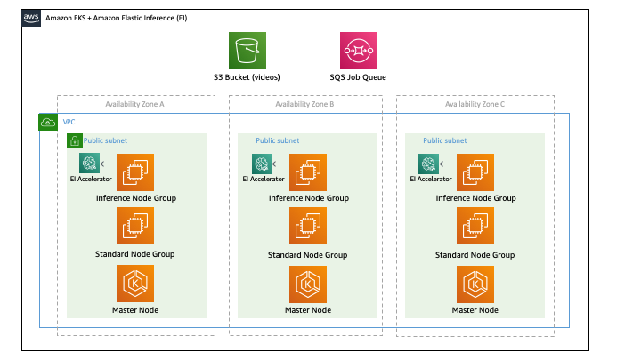

## Amazon Elastic Inference with Amazon EKS

This repository contains resources demonstrating how to use Amazon Elastic Inference (EI) and Amazon EKS together to deliver a cost optimized, scalable solution for performing inference on video frames. More specifically, the solution herein runs containers in Amazon EKS that read a video from Amazon S3, preprocess its frames, then send the frames for object detection to a TensorFlow Serving container modified to work with Amazon EI. This computationally intensive use case showcases the advantages of using Amazon EI and Amazon EKS together to achieve accelerated inference at low cost within a scalable, containerized architecture.



## Deploy

The following steps require the [AWS Command Line Interface](https://aws.amazon.com/cli/) to be installed and [configured](https://docs.aws.amazon.com/cli/latest/userguide/cli-chap-configure.html). Additionally, you must follow the AWS instructions for installing the [IAM compatible version of kubectl](https://docs.aws.amazon.com/eks/latest/userguide/install-kubectl.html).

Amazon EKS and Elastic Inference are currently not available in all AWS regions. Consult the [AWS Region Table](https://aws.amazon.com/about-aws/global-infrastructure/regional-product-services/) for more information.

The first step in the process is to clone this repository:

```
git clone https://github.com/aws-samples/amazon-elastic-inference-eks.git && cd amazon-elastic-inference-eks
```

In order to create both the Amazon EKS cluster and the node groups in a single step, first we must create an IAM role to be used by a Custom Resource in the CloudFormation template to programmatically modify the EKS aws-auth ConfigMap. Modifying the aws-auth ConfigMap is required so that the EC2 instances can register themselves with the cluster.

```
make create-role
```

After the IAM role is created, you can launch the cluster by running:

```
make create-cluster
```

This step takes 10-15 minutes to create all of the required resources. Once the command is executed,
an AWS Management Console link to the CloudFormation section is printed. You can monitor the resource creation
here. Once the stack status is, CREATE_COMPLETE, you can move on to the next step.

If you are interested in overriding the default values in the Makefile, create a custom.mk file in the same directory and set the values. The following parameters can be overridden:

```
CLUSTER_STACK_NAME ?= eks-ei-blog
CLUSTER_NAME ?= $(CLUSTER_STACK_NAME)
EKS_ADMIN_ROLE ?= arn:aws:iam::$(AWS_ACCOUNT_ID):role/EksEiBlogPostRole
REGION ?= 'us-east-1'
AZ_0 ?= 'us-east-1a'
EKS_ADMIN_ROLE ?= arn:aws:iam::$(AWS_ACCOUNT_ID):role/EksEiBlogPostRole
REGION ?= 'us-east-1'
AZ_0 ?= 'us-east-1a'
AZ_1 ?= 'us-east-1b'
SSH_KEY_NAME ?= 'somekey'
USER_ARN ?= $(shell aws sts get-caller-identity --output text --query 'Arn')
EI_TYPE ?= 'eia1.medium'
NODE_INSTANCE_TYPE ?= 'm5.large'
INFERENCE_NODE_INSTANCE_TYPE ?= 'c5.large'
NODE_ASG_MIN ?= 1
NODE_ASG_MAX ?= 5
NODE_ASG_DESIRED ?= 2
INFERENCE_NODE_ASG_MAX ?= 6
INFERENCE_NODE_ASG_MIN ?= 2
INFERENCE_NODE_ASG_DESIRED ?= 2
NODE_VOLUME_SIZE ?= 100
INFERENCE_NODE_VOLUME_SIZE ?= 100
LAMBDA_CR_BUCKET_PREFIX ?= 'pub-cfn-cust-res-pocs'
DEFAULT_SQS_TASK_VISIBILITY ?= 7200
DEFAULT_SQS_TASK_COMPLETED_VISIBILITY ?= 500
INFERENCE_SCALE_PERIODS ?= 1
INFERENCE_SCALE_OUT_THRESHOLD ?= 2
INFERENCE_SCALE_IN_THRESHOLD ?= 2
INFERENCE_NODE_GROUP_NAME ?= 'inference'
NODE_GROUP_NAME ?= 'standard'
INFERENCE_BOOTSTRAP ?= --kubelet-extra-args --node-labels=inference=true,nodegroup=elastic-inference
BOOTSTRAP ?= --kubelet-extra-args --node-labels=inference=false,nodegroup=standard
```

After the cluster is created, update your local [kubeconfig](https://kubernetes.io/docs/tasks/access-application-cluster/configure-access-multiple-clusters/) file by running:

```
make update-kubeconfig
```

You can test your Amazon EKS authentication by running:

```
kubectl get nodes
```

Next, we are going to deploy the [DaemonSet](https://kubernetes.io/docs/concepts/workloads/controllers/daemonset/) to the cluster:

```
kubectl apply -f k8s-daemonset.yml
```

You can check the status of the deployment by running:

```
kubectl describe daemonset inference-daemon
```
Wait until the "Pod Status" shows the total oucnt as "Running"

## Run

Next you deploy a sample MOV file to the data bucket created by the stack. In the S3 console,
you will see a bucket that has the format of (default CLUSTER/STACK NAME is - eks-ei-blog):

```
task-data-bucket-ACCOUNT_ID-REGION-CLUSTER/STACK NAME
```

From the command line, you can use something similar to upload sample content to the bucket:

```
aws s3 cp --region REGION sample.mov s3://task-data-bucket-ACCOUNT_ID-REGION-CLUSTER/STACK NAME
```

Once you have sample data in the bucket, in the SQS section of the AWS Management Console, [submit a sample task](https://docs.aws.amazon.com/AWSSimpleQueueService/latest/SQSDeveloperGuide/sqs-send-message.html). The queue name resembles:

```
task-queue-CLUSTER/STACK NAME
```

The format of the message submitted in the console is:


```
{ "bucket": "task-data-bucket-ACCOUNT_ID-REGION-CLUSTER/STACK NAME", "object": "sample.mov" }
```

Change the bucket name and the object key to match your deployment.

To see the inference results, you can [view messages](https://docs.aws.amazon.com/AWSSimpleQueueService/latest/SQSDeveloperGuide/sqs-receive-delete-message.html) on the task completed SQS queue in the AWS Management Console.


## Cleanup

You must delete the DaemonSet before terminating the Amazon EKS cluster, or there will be resources that cannot be
reclaimed by CloudFormation. To do so, run:

```
kubectl delete -f k8s-daemonset.yml
```

Once the DaemonSet is terminated, you can [delete the stack](https://docs.aws.amazon.com/AWSCloudFormation/latest/UserGuide/cfn-console-delete-stack.html) in the CloudFormation section of the AWS Management Console.

## License Summary

This sample code is made available under the MIT-0 license. See the LICENSE file.
